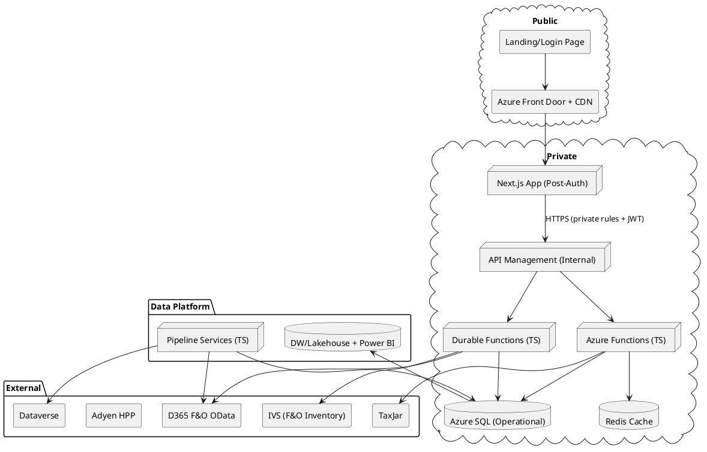

# SPEC-001-Internal Order Entry & Account Management for D365 F&O

## Background

Today, **D365 F&O** handles order entry, while Dataverse apps — **Customer
Service Workspace** and **Sales Hub** — are used for broader CRM processes.
**Dual-write** connects the two but adds complexity and latency that do not
align with our core needs. For the MVP, we are focusing on **fast, reliable
order entry** and **account management** for internal agents, not the full CRM
feature set.

The MVP experience is designed for the call-in or internal order-taking process:
an agent searches for a customer record, opens their profile page with all
relevant account details, and starts an order. This keeps the focus on speed,
accuracy, and usability for the highest-frequency tasks.

Orders will be confirmed and sent to D365 F&O via existing **OData endpoints**
(order header + lines). The product catalog uses **product masters and
variants** with only **Color** and **Size** dimensions, stored in a **single
normalized table** in Azure SQL with flags for masters vs variants. Pricing and
on-hand inventory are stored alongside for fast lookup and are also used to feed
the **AI-ready data warehouse** and **Power BI model**.

---

## Requirements (Draft – MoSCoW)

**Must have**

- **Account management UI**: search by name, customer ID, phone, or email; view
  customer profile page with addresses, tax status, and recent orders.
- **Order entry**: Matrix SKU grid for large variant counts (e.g., 12 sizes × 6
  colors, up to 100 variants); quick add for single SKU.
- **Cart**: create/update sales lines in-app; group by product; subtotals by
  style and overall.
- **Products/Pricing/Inventory**: real-time or cached pricing and on-hand
  availability; inventory optionally refreshed real-time on order submit using
  **F&O IVS add-on**.
- **Checkout & Payment**: Adyen Hosted Payment Pages (HPP); handle tokens/saved
  cards; no PCI storage in-app.
- **Shipping**: tiered shipping tables with item-level flat-rate and per-unit
  surcharges; exclusion rules for subtotal calculations.
- **Tax**: integrate **TaxJar** for estimation/commit; respect F&O tax
  exemptions with address-to-state consolidation for performance.
- **Data sync**: Orders, customers, products, pricing, and inventory hydrated
  from F&O/Dataverse into Azure SQL via in-house pipelines (\~hourly) with
  on-demand OData checks for critical scenarios.
- **Performance**: <200ms p95 search, <1.5s p95 add-to-cart; smooth operation
  for carts with 100+ lines.
- **Reliability**: confirm-before-success when crossing into ERP; idempotent
  submission; audit trails.
- **Security**: Entra ID (internal); JWT validation at APIM boundary.

**Should have**

- Soft inventory reservation at submit or hold.
- Save/reuse order templates.
- Error reconciliation dashboard for failed OData posts.
- Power BI semantic model on warehouse for live agent KPIs.

**Could have**

- Promotions/discount rules aligned with F&O.
- Email/SMS notifications for order status.
- Full CRM workflows (leads, opportunities, etc.) added later.

---

## Method (Part 1 — Architecture Overview)

**Stack & topology:**

- **Frontend:** Next.js (strict TypeScript), Node 20; public landing/login via
  Azure Front Door + CDN; all authenticated routes private behind APIM.
- **Security boundary:** APIM enforces JWT validation, Entra ID auth flows, and
  custom rules; frontend only sees business endpoints defined via
  OpenAPI/Swagger.
- **API layer:** Azure Functions (Node 20, TypeScript) + Azure Durable Functions
  (App Service Plan) for stateful workflows; queues and routing handle
  background processes.
- **Network:** All backend components (Functions, SQL, Redis) use private
  endpoints.
- **Data:** Azure SQL for operational data; DW/Lakehouse for analytics; Redis
  for hot cache.
- **Integrations:** OData (F&O), Dataverse (read minimal data as needed),
  TaxJar, Adyen HPP, IVS.
- **Pipelines:** In-house TypeScript services (e.g., `CustomerService`,
  `ProductService`, `PipelineService`) for source integration; pipelines
  triggered on schedule or via APIM.

**Key flows**

1. **Account lookup**: Agent searches; backend fetches from Azure SQL (cached
   from F&O/Dataverse).
2. **Order creation**: From account profile → cart built in SQL; checkout
   triggers payment, tax, shipping calculation.
3. **Order submission**: Durable Function orchestrates payment → tax →
   header/lines to F&O → poll staging until present → success.
4. **Inventory checks**: Cached for browsing; real-time at submit if needed.
5. **Data sync**: Pipeline services refresh operational SQL on schedule.

---
